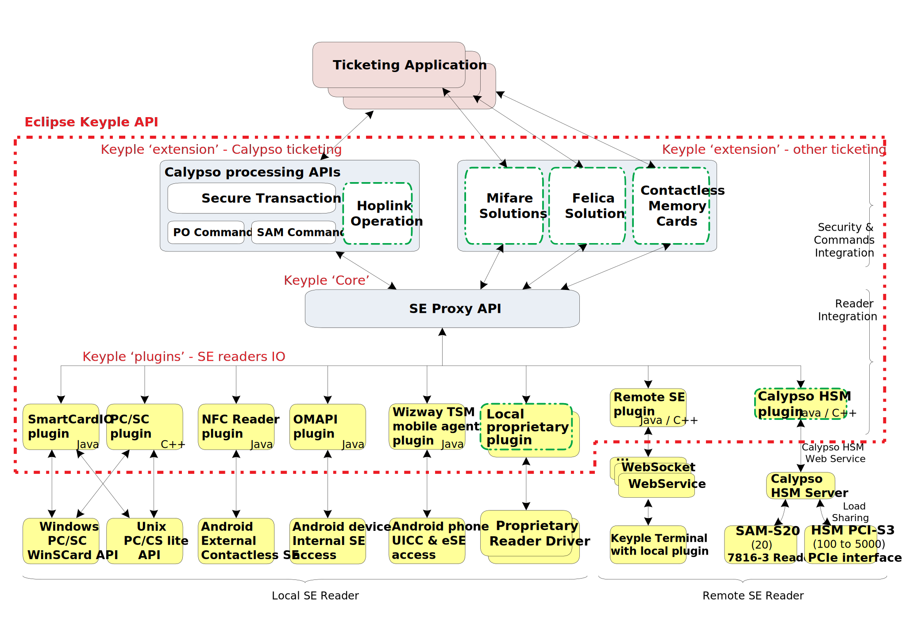
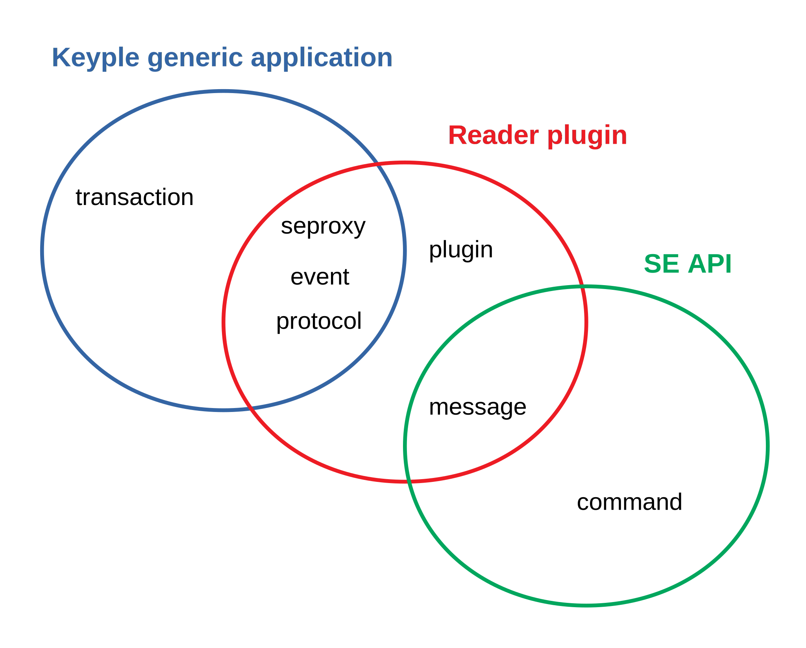
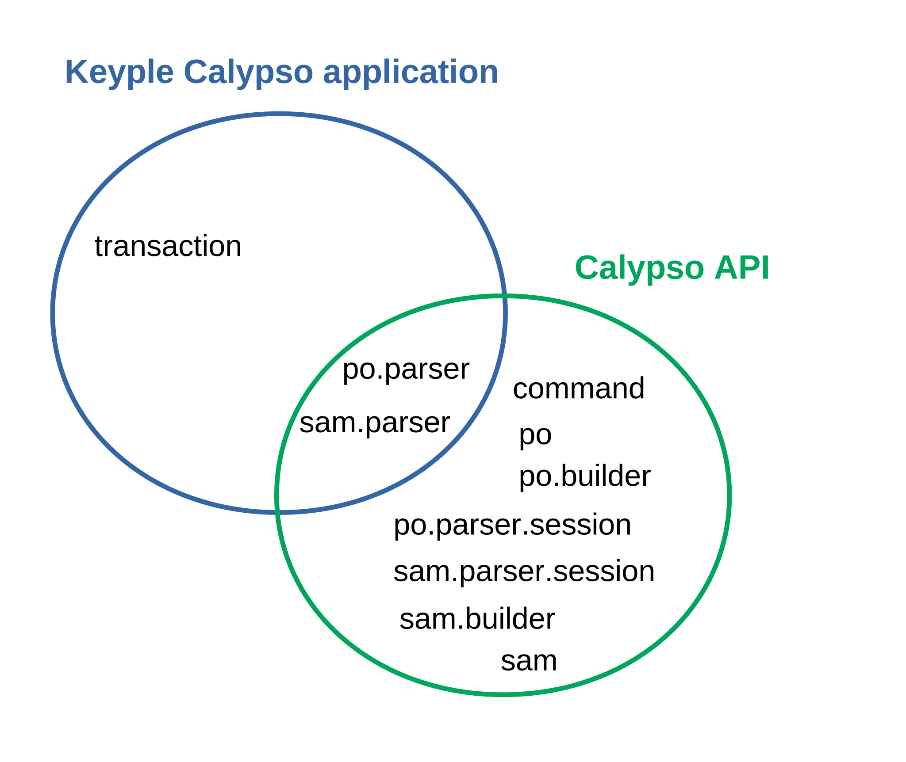

# Keyple Java

This is the temporary repository for the Java implementation of the 'Eclipse [Keyple](https://keyple.org/)' API.
- The Eclipse Foundation is currently checking the IP of these elements.
- Soon the Java source of Keyple will be transfered to the repository https://github.com/eclipse/keyple-java.

## Supported platforms
- Java SE 1.6 compact2
- Android 4.4 KitKat API level 19

## Documentation
Function specification, Javadoc and compiled JARs are on [keyple-doc](https://calypsonet.github.io/keyple-doc/).

## keyple-java repositories structure

- Modules that are provide as artifacts
  - keyple-core: source and unit tests for the SeProxy module.
  - keyple-calypso: source and unit tests for the Calypso library.
  - keyple-plugin: source and unit tests for the different plugins: smartcard.io PC/SC, Stub, Android NFC, Android OMAPI, etc.
- developer support, testing
  - example: source for the generic and Calypso implementation examples.
  - integration: source for the integration code (SDK).

## JARs
When moved to the Eclipse repository, the Eclipse Keyple artifacts will be published on Maven. Pending temporary artifacts could be downloaded here:

- Keyple modules:
  - **'Keyple Core module' JAR**:  [https://calypsonet.github.io/keyple-java/develop/jars/keyple-core-1.0.0-RC4.jar](https://calypsonet.github.io/keyple-java/develop/jars/keyple-core-1.0.0-RC4.jar)
  - **'Keyple Calypso Library JAR'**: [https://calypsonet.github.io/keyple-java/develop/jars/keyple-calypso-1.0.0-RC4.jar](https://calypsonet.github.io/keyple-java/develop/jars/keyple-calypso-1.0.0-RC4.jar)
- Keyple plugins:
  - **'Keyple PC/SC plugin JAR'**: to manage PC/SC readers on a PC environment supporting the # javax.smartcardio API[https://calypsonet.github.io/keyple-java/develop/jars/keyple-plugin-pcsc-1.0.0-RC4.jar](https://calypsonet.github.io/keyple-java/develop/jars/keyple-plugin-pcsc-1.0.0-RC4.jar)
  - **'Keyple NFC Android plugin AAR'**: to operate the contactless reader of an Android Environment supporting the android.nfc API [https://calypsonet.github.io/keyple-java/develop/jars/keyple-plugin-android-nfc-1.0.0-RC4.aar](https://calypsonet.github.io/keyple-java/develop/jars/keyple-plugin-android-nfc-1.0.0-RC4.aar)
  - **'Keyple OMAPI Android plugin AAR'**: to operate the internal contacts readers of an Android Environment supporting the OMAPI [https://calypsonet.github.io/keyple-java/develop/jars/keyple-plugin-android-omapi-1.0.0-RC4.aar](https://calypsonet.github.io/keyple-java/develop/jars/keyple-plugin-android-omapi-1.0.0-RC4.aar)
  - **'Keyple "stub" plugin JAR'**: plugin to simulate the presence of fake readers with or without fake cards [https://calypsonet.github.io/keyple-java/develop/jars/keyple-plugin-stub-1.0.0-RC4.jar](https://calypsonet.github.io/keyple-java/develop/jars/keyple-plugin-stub-1.0.0-RC4.jar)
  - **'Keyple "Remote SE" plugin JARs'**: plugin & service to manage a SE remotely in a transparent way:
    - the plugin [https://calypsonet.github.io/keyple-java/develop/jars/keyple-plugin-remotese-plugin-0.1.0-SNAPSHOT.jar](https://calypsonet.github.io/keyple-java/develop/jars/keyple-plugin-remotese-plugin-0.1.0-SNAPSHOT.jar)
    - the native reader service [https://calypsonet.github.io/keyple-java/develop/jars/keyple-plugin-remotese-native-reader-0.1.0-SNAPSHOT.jar](https://calypsonet.github.io/keyple-java/develop/jars/keyple-plugin-remotese-native-reader-0.1.0-SNAPSHOT.jar)
    - the transport [https://calypsonet.github.io/keyple-java/develop/jars/keyple-plugin-remotese-transport-api-0.1.0-SNAPSHOT.jar](https://calypsonet.github.io/keyple-java/develop/jars/keyple-plugin-remotese-transport-api-0.1.0-SNAPSHOT.jar)

## Keyple packages' usages
The packages to import in order to implement a ticketing **application**, a reader **plugin**, or a **SE library** to manage a specific solution.

- generic to any SE solution

- specific to Calypso

